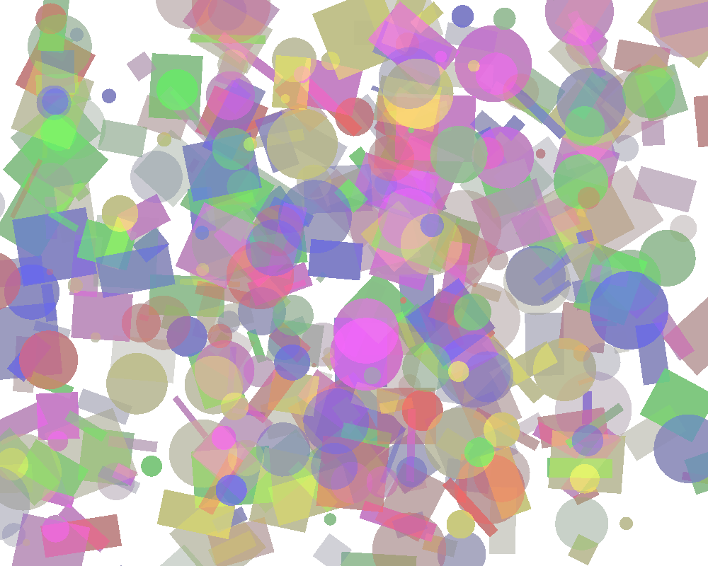
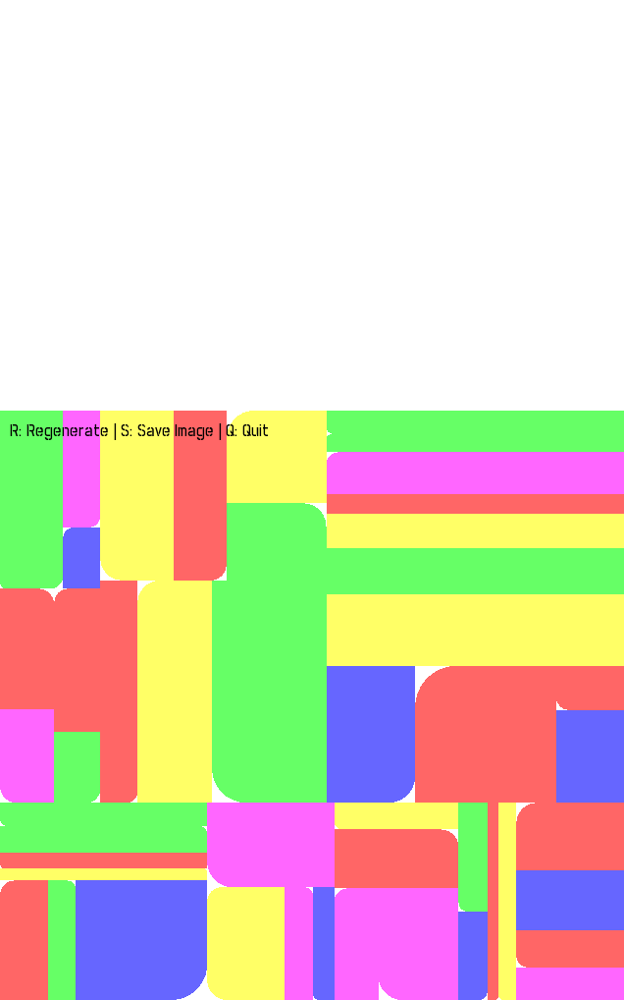
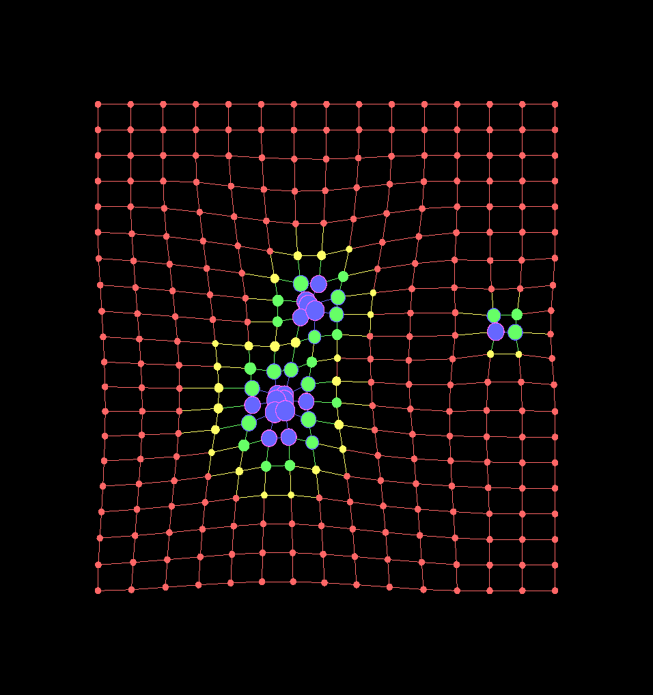

# Generative-art

Implementation of generative art in Cpp

## Dependencies

Used `Simple and Fast Multimedia Library` (SFML) Library for simple 2D graphics handling.

```bash
sudo apt-get install libsfml-dev
```

## Compilation

**NOTE**: First read `CMakeList.txt`

```
mkdir build
cd build
cmake ..
```

To `make` `audiovisualizer`

```sh
cd audiovisualizer/
make
```

To `make` `monograph`

```sh
cd monograph/
make
```

To `make` `gridgen`

```sh
cd gridgen/
make
```

To `make` `particlesystem`

```sh
cd particlesystem
make
```

#### Run

```bash
./audiovisualizer
./monograph
./gridgen
./particlesystem
```

## Output







