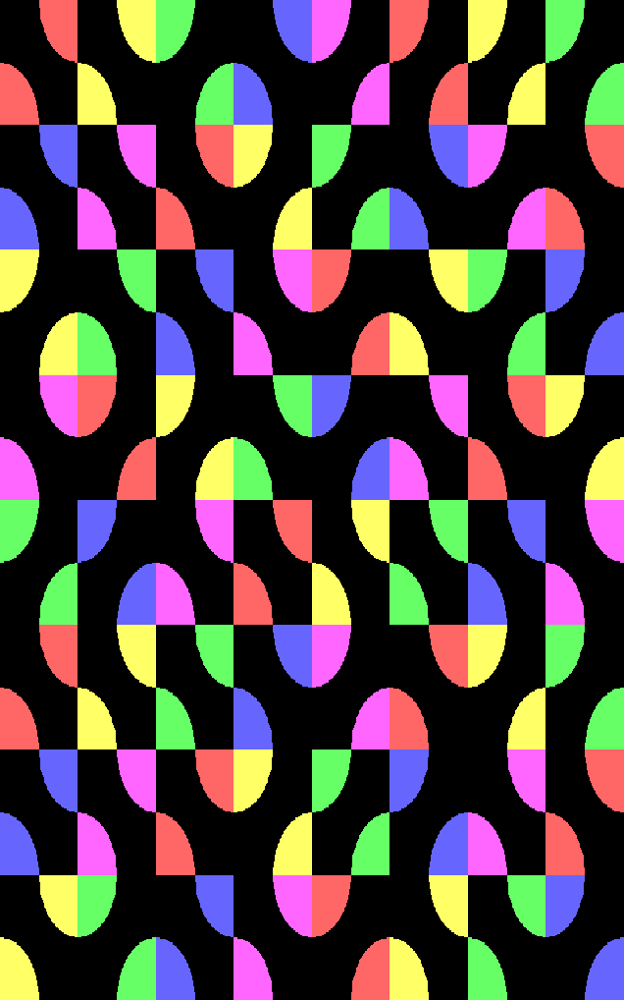

# Generative-art

Implementation of generative art in Cpp

## Dependencies

Used `Simple and Fast Multimedia Library` (SFML) Library for simple 2D graphics handling.

```bash
sudo apt-get install libsfml-dev
```

## Compilation

**NOTE**: First read `CMakeList.txt`

```
mkdir build
cd build
cmake ..
```

To `make` {Project name}

Project names:

1. audiovisualizer
2. monograph
3. gridgen
4. particlesystem
5. fabric
6. gabrielshorn
7. smithtiles

For example:

```sh
cd audiovisualizer/
make
```

After making successfully:

#### Run

```bash
./audiovisualizer_app
./monograph_app
./gridgen_app
./particlesystem_app
./fabric_app
./gabrielshorn_app
./smithtiles_app
```

## Output



