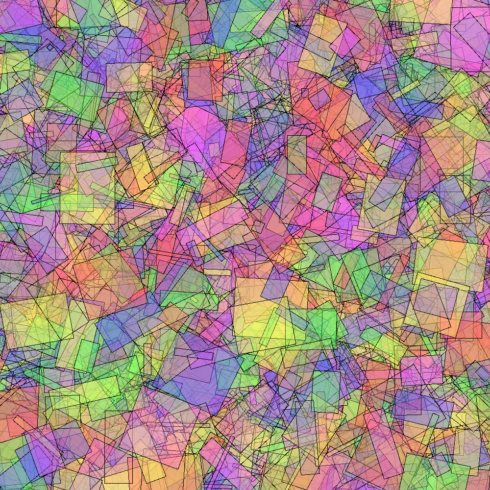

# Generative-art

Implementation of generative art in Cpp

## Dependencies

Used `Simple and Fast Multimedia Library` (SFML) Library for simple 2D graphics handling.

```bash
sudo apt-get install libsfml-dev
```

## Compilation

```
mkdir build
cd build
cmake ..
make
```

## Output


